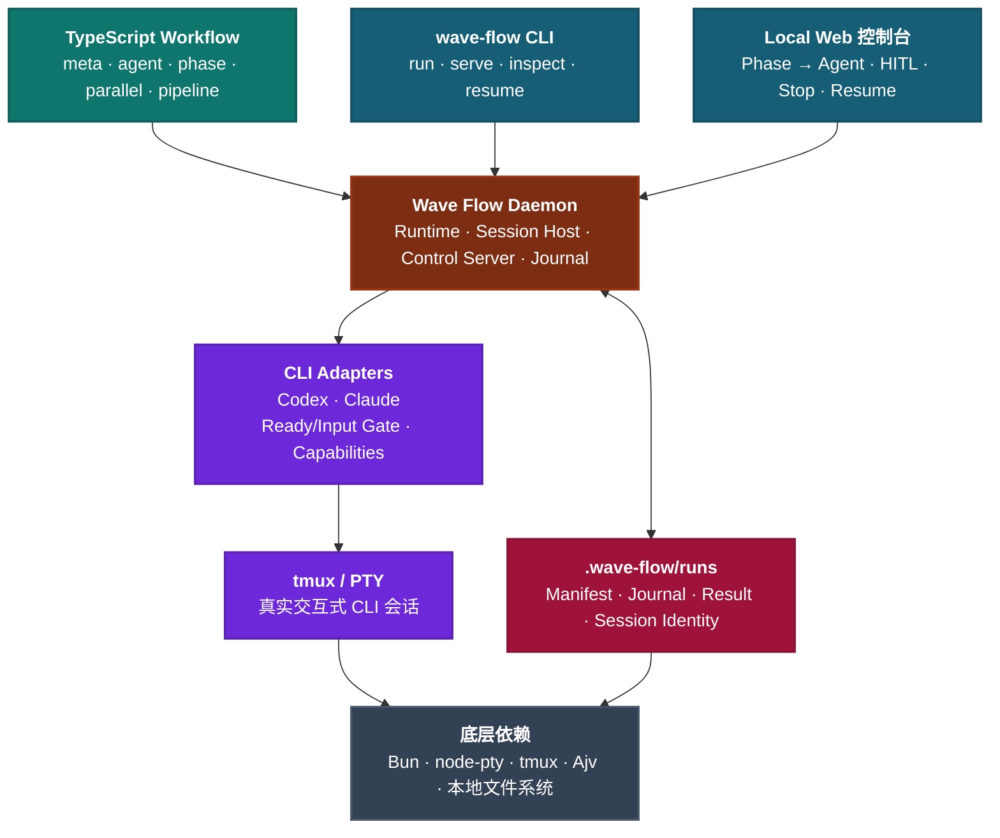
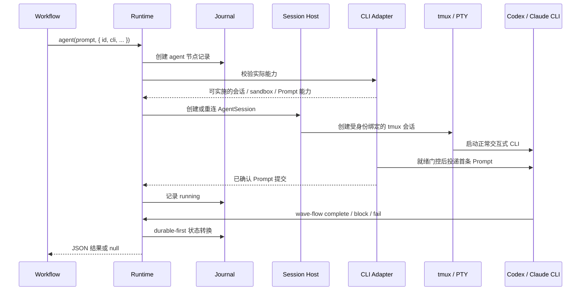
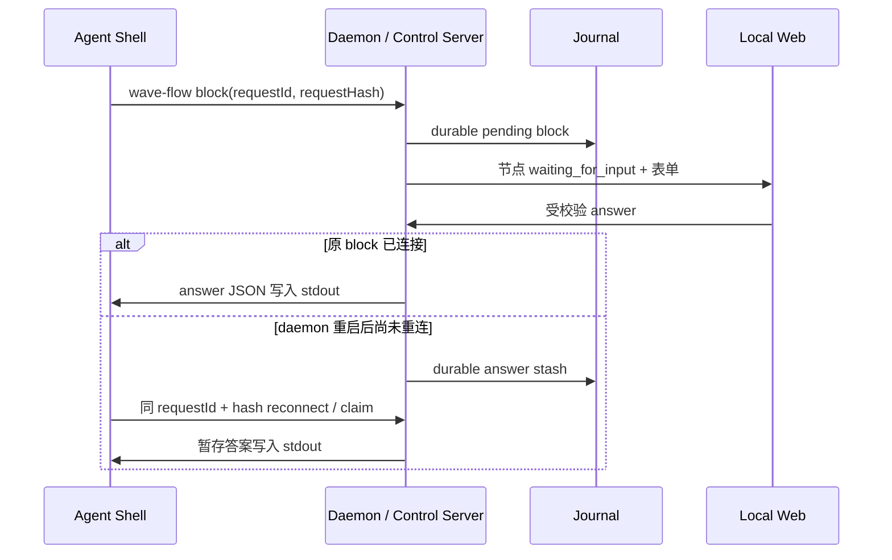
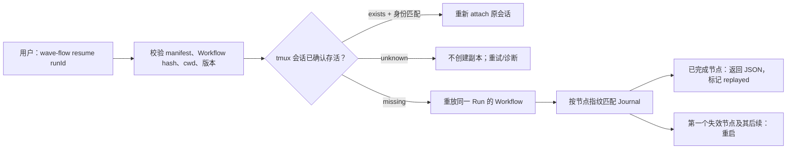

# Wave Flow 项目架构

本文是 Wave Flow 的项目架构地图，服务于研发对齐、代码导航与技术汇报。完整运行语义以 [设计规格](./wave-flow-design.md) 为准；项目级取舍和答辩材料见 [项目笔记](./project-notes.md)。

> 当前已完成第 1 章的目录整理与旧实现删除；新架构 P0/P1 的运行能力尚未实现。本文严格区分已建立的职责边界和未来能力，不得把历史 `codex exec` Runtime 或目录结构误述为可用产品能力。

## 1. 汇报总览



图从上到下的含义：Workflow 是唯一编排真源；CLI 与 Web 都是 daemon 的本地客户端；daemon 是状态与生命周期权威；Adapter 将节点映射为正常 CLI；tmux/PTY 保存真实会话；Journal 保存可恢复的执行证据。

## 2. 核心运行数据流

### P0：创建并运行一个 Agent 节点



关键点：Runtime 不解析 TUI 文本，不根据“终端看似空闲”判断完成；Adapter 负责 CLI 专属的就绪与 Prompt 提交确认；只有 Control Server 验证过的上报可以推进节点状态。

### P0：`block` 的可靠人机交互



`block` 的问题、回答和重连身份都属于同一 Agent 会话；它不重跑 Workflow，也不向 CLI TUI 盲目模拟输入。

### P0：显式恢复



恢复由用户显式发起。Journal 是执行证据，不是 VM 快照，不回滚文件或外部系统。

## 3. P0 模块地图

当前已建立以下源码目录及边界说明。Workflow 层已经具备受信任本地 TypeScript Workflow 的加载、静态 `meta` 契约验证，以及由 AsyncLocalStorage 隔离的 `agent/phase/parallel/pipeline/log` 作者 API；Runtime 仅提供该 API 的最小内存宿主协议。Session Host、Adapter、Control Server、Journal、daemon、CLI 与 Web 均尚未实现。

```text
src/
  workflow/                 # Workflow 模块加载、meta 校验、作者 API 注入（仅 wave-flow 值导入）
  runtime/                  # Run、Phase、Agent 节点调度和状态机
  sessions/                 # AgentSession 生命周期
    backends/               # tmux / PTY，身份、三态探测、detach/destroy
    bootstrap/              # Ready/Input Gate、首条 Prompt 提交确认编排
  adapters/                 # Codex / Claude 正常 CLI Adapter、Capabilities
  control/                  # complete / block / fail、capability 验证、Block Broker
  journal/                  # Manifest、事件、结果、pending block、Replay 索引
  daemon/                   # localhost HTTP/API、WebSocket、daemon 生命周期
  cli/                      # 用户命令与受管 Agent 的 wave-flow 子命令
  web/                      # P0 Local Web 控制台
  shared/                   # 纯类型、ID、哈希、JSON/路径安全工具

test/
  workflow/ runtime/ sessions/ adapters/ control/ journal/ daemon/ cli/
```

目录按职责而非技术实现分层。尤其要保持以下边界：

| 目录 | 负责 | 不负责 |
| --- | --- | --- |
| `workflow/` | `meta`、`run(args)`、`agent/phase/parallel/pipeline/log` 作者 API | 启动具体 CLI |
| `runtime/` | 节点/Phase 状态、动态调度、并发护栏 | 判断 CLI composer 是否就绪 |
| `sessions/` | tmux/PTY、会话身份、attach/detach/destroy | 决定 Workflow 拓扑 |
| `adapters/` | 特定 CLI 的命令、能力、Ready/Input Gate | 持久化 Run 状态 |
| `control/` | 受控 Agent 上报、HITL、重连认领 | 解释 Agent 自然语言 |
| `journal/` | durable 事件、结果、Replay 匹配 | 回滚副作用 |
| `daemon/` | localhost API 和服务生命周期 | 复制 Workflow 业务规则 |
| `cli/` | 参数解析和 API 调用 | 绕过 daemon 直接改状态 |
| `web/` | Phase → Agent 展示与操作 | 编辑 Workflow 源码 |

## 4. Workflow 作者层

Workflow 采用 Deer 风格 TypeScript ESM 模块入口，并保留 Claude/Deer 共同的编排原语：

```ts
import { agent, phase, parallel } from "wave-flow";

export const meta = {
  name: "security-review",
  description: "扫描并汇总代码安全风险。",
  phases: [{ title: "扫描" }, { title: "汇总" }],
  exampleArgs: { target: "src" },
};

export default async function run(args: { target: string }) {
  phase("扫描");

  const scans = await parallel([
    () => agent("检查鉴权风险。", {
      id: "scan:auth",
      cli: "codex",
      input: { target: args.target },
      sandbox: "read-only",
    }),
  ]);

  phase("汇总");
  return agent("汇总扫描结果。", {
    id: "summary",
    cli: "claude",
    input: { scans },
  });
}
```

`meta` 位于 imports 之后、类型和可执行代码之前，且自身是纯字面量。`phase()` 是共享状态，不能在 `parallel()` thunk 或 `pipeline()` stage 中切换。每个 `agent()` 必须显式提供 Run 内唯一的 `id` 与目标 CLI，并且在调用前已选择 meta 声明的 Phase。

## 5. Agent Session 层

一个 `agent()` 调用对应一个 `AgentSession`：

```text
AgentSession
  ├─ runId / nodeId / agentSessionId
  ├─ Adapter 实际生效能力与 sandbox
  ├─ tmux session identity
  ├─ 原始 CLI PID / liveness evidence
  ├─ terminal record
  └─ node capability
```

tmux 是 P0 默认后端；PTY 仅用于开发或故障降级。tmux 会话使用不透明命名和身份记录，探测为 `exists / missing / unknown` 三态。`unknown` 绝不能被当作 `missing`，避免因 tmux 控制面短暂故障新建重复 Agent。

首条 Prompt 的路径是：Adapter 检测 composer 就绪 → Session Bootstrap 投递 → Adapter 确认提交已进入真实 CLI 会话。Runtime 只消费明确状态，不解析 ANSI 或自然语言。

## 6. 控制、结果与 HITL

受管 Agent 只能通过同一个 `wave-flow` CLI 上报：

```text
wave-flow complete --summary ... --result-file ...
wave-flow block --question ... --input ...
wave-flow fail --reason ...
```

节点状态：

```text
queued → running → waiting_for_input → running → completed
                    ├──────────────────────────→ failed
                    ├──────────────────────────→ cancelled
                    └──────────────────────────→ interrupted
```

- `complete`：JSON 对象经 Schema 校验、结果与 Journal durable-first 落盘后，`agent()` 返回对象。
- `fail`：`agent()` 返回 `null`。
- `block`：原命令等待，Web 回答后 JSON 从 stdout 返回；重启后通过 request id、request hash、dormant restore 与 answer stash 恢复。
- `cancelled` 与 `interrupted` 由用户/Runtime 产生，不能伪装成 Agent 业务失败。

## 7. Capabilities 与安全门

```text
wave-flow capabilities --json
  → Creator Skill 只消费官方能力快照
  → 生成可实施的 cli + sandbox + session 组合
  → Runtime 启动前重新校验
  → 无法实施则 fail closed
```

能力项均为 `available / unavailable / unknown`。必须覆盖正常交互会话、已验证首 Prompt 投递、持久 tmux 会话、只读 sandbox 与 workspace-write sandbox。`unknown` 不可当作可用；Journal 与 Web 显示实际生效策略，不能只展示 Workflow 请求值。

一期默认共享项目 cwd：只读任务可以并行；写入任务只有在目录、文件和逻辑范围可证明不重叠时才并行，否则顺序执行。Worktree 是后续显式隔离能力。

## 8. Web 分期

### P0：Local Web 控制台

```text
Run 总览
  ├─ Workflow 名称、cwd、时间、Run 状态
  ├─ Phase 导航与进度
  ├─ Agent 卡片：状态、CLI、模型、耗时、摘要、replayed
  ├─ Agent 详情：事件、JSON 结果、停止
  └─ block 表单、停止与显式恢复
```

P0 不嵌入交互式终端。终端记录作为事件/诊断数据保存在 Session/Journal 层，供后续 Web Terminal 使用。

### P1：Web Terminal

参考 Botmux：每个浏览器标签通过独立 tmux attach 连接真实会话；从 tmux 权威 scrollback 初始化；同一节点只允许一个 write-owner lease，其余标签只读。关闭 viewer 不停止 Agent。

### P2：显式 Retry

`failed` 节点不接受 `complete`，也不会被状态机复活。用户从失败节点的诊断或终端记录显式选择 Retry 时，Runtime 创建新的 Agent 节点、会话身份和 Journal 事实，并以 `retryOfNodeId` 指向原节点。Retry 是新的 attempt，不是 `failed → running → completed` 的状态回退；下游依赖和会话复用策略在实现前单独验证。

## 9. 外部参考的取舍

| 参考 | Wave Flow 采用 | 不采用 |
| --- | --- | --- |
| Claude Code Dynamic Workflows | 代码编排、Phase → Agent 观测、同 Run 的顺序 replay 思路 | 受限纯脚本环境、无中途业务 HITL 的限制 |
| Deer Workflow | TypeScript `run(args)` 入口、meta、agent/phase/parallel/pipeline、失败返回 `null` | 将其一次性 Agent Runtime 当作正常 CLI Session Host |
| Botmux | PTY/tmux Backend、三态探测、Ready/Input Gate、提交确认、pending ask 重连 | 飞书、多人授权、远程终端、20+ Adapter、Webhook/on-call、外部会话 adopt |
